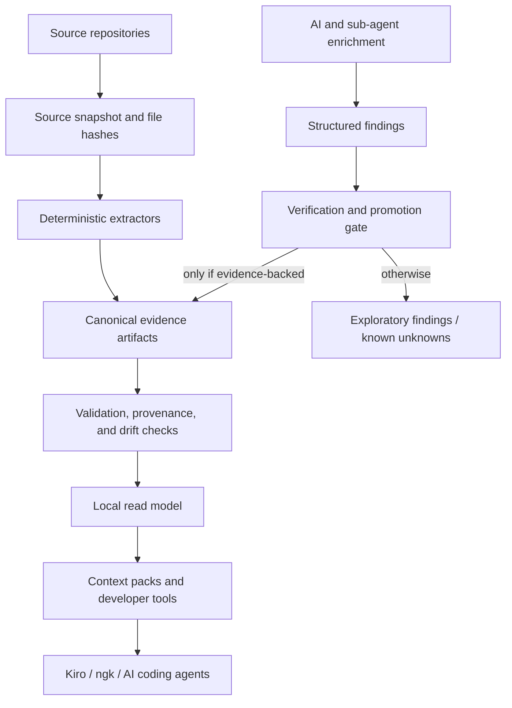
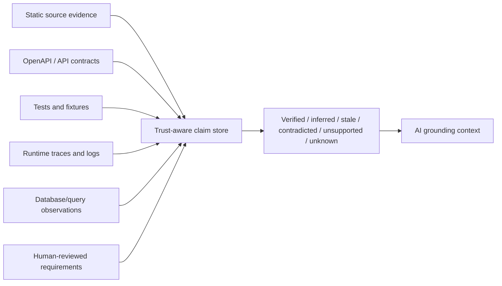

# CodeAtlas

CodeAtlas is a deterministic-first framework for reverse-engineering mature codebases into evidence-backed, machine-readable project knowledge for AI coding agents, developer CLIs, reviewers, test generators, and visualisation tools.

> **Make AI coding agents less wrong by forcing them to operate inside a verified evidence boundary.**

> **A deterministic-first code evidence compiler and AI-grounding orchestrator.**

> **CodeAtlas should be the thing AI agents must cite, obey, and be limited by — not because it knows everything, but because it knows exactly what is verified, what is inferred, what is stale, what is unsupported, and what is unknown.**

CodeAtlas is not trying to be an omniscient AI that magically understands a whole software system. Its purpose is to compile source code and adjacent engineering evidence into a trust-aware knowledge layer that separates verified facts from inferred, partial, stale, contradicted, unsupported, and unknown claims.

The strategic goal is to make repository-aware AI work more like evidence-backed engineering and less like plausible text generation.

## Project overview

CodeAtlas turns mature software systems into a local, reviewable knowledge substrate for humans and AI agents.

It is designed to:

- compile source files, symbols, routes, endpoints, flows, payloads, tests, and configuration into deterministic artifacts;
- attach evidence, provenance, confidence, and capability gaps to generated knowledge;
- expose machine-readable context packs for Kiro, `ngk`, code review, impact analysis, test selection, smart terminals, and future automation;
- force AI agents to operate inside explicit evidence boundaries instead of treating repo text, generated summaries, and guesses as equally trustworthy;
- surface known-unknowns instead of silently pretending unsupported libraries, stale artifacts, or missing extractors are understood;
- keep AI/sub-agent enrichment downstream of deterministic artifacts rather than allowing prompt-first output to become the source of truth.

A useful CodeAtlas answer should not merely say *what it thinks*. It should show:

```text
what is verified
what is inferred
what is stale
what is contradicted
what is unsupported
what is partial
what is unknown
what evidence supports the answer
what evidence is missing
where the agent must refuse to be authoritative
```

## Trust boundary architecture

The safest mental model is two-layered:

```text
Tier 1: Canonical Evidence Layer
  deterministic extraction only
  source/provenance snapshot
  file hashes and source spans
  parser-backed symbols/routes/endpoints/contracts
  validated facts, edges, flows, and manifests
  explicit capability gaps and stale-state detection

Tier 2: Derived Intelligence Layer
  context packs
  impact analysis
  trace exploration
  review risk
  likely relevant tests
  AI/sub-agent findings
  summaries and explanations
```

Tier 1 is the foundation. It should be strict, reproducible, schema-valid, provenance-bound, and boring.

Tier 2 is where CodeAtlas becomes useful for developer workflows. It may rank, summarize, cluster, explain, and propose, but it must preserve trust labels and must not promote unsupported AI output into canonical knowledge.



Source code remains the ultimate authority for current behaviour. CodeAtlas becomes authoritative only for claims that it can verify, cite, validate, and keep fresh.

## Runtime and business-truth boundary

CodeAtlas can become very strong at code-derived truth, but runtime and business truth require a wider evidence loop.

A future runtime/business-truth architecture should treat business behaviour as something proven by multiple evidence sources, not inferred from static code alone:



Static code can say *what the code appears able to do*. Tests, traces, logs, contracts, schemas, runtime config, and reviewed requirements are needed before CodeAtlas can safely say *what the system actually does* or *what the business intends*.

Runtime/business claims should therefore be promoted only when supported by enough evidence for the claim type. For example:

- an endpoint exists: source route or OpenAPI evidence may be enough;
- a request path works: route evidence plus executable test or trace evidence is stronger;
- a permission rule is enforced: backend dependency/middleware evidence plus test evidence is required;
- a business rule is intended: source evidence alone is not enough; reviewed requirements, tests, or product/domain evidence should be attached;
- a flow is authoritative end-to-end: every leg must be verified, and unsupported libraries or missing runtime evidence must downgrade the trace to exploratory.

The long-term ambition is not to remove uncertainty. It is to make uncertainty explicit and enforceable.

It is designed for ecosystems like:

- React / TypeScript frontends
- FastAPI / Pydantic backends
- OpenSearch/data-access layers
- multi-repo config/schema/sample-data setups
- file-system-only AI workflows where MCP is disabled
- Kiro CLI and custom developer CLIs such as `ngk`

## Canonical status

**The V2 deterministic path is canonical. MCP must be treated as unavailable.**

The older prompt-first Kiro extraction pipeline remains in the repository as legacy/exploratory material, but it should not be the default first run for a new project.

Start with:

```bash
python3 atlas/tools/codeatlas_v2_canonical.py doctor
python3 atlas/tools/codeatlas_v2_canonical.py all
```

Then build the no-MCP local memory layer:

```bash
python3 atlas/tools/codeatlas_capability_audit.py
python3 atlas/tools/codeatlas_sqlite_read_model.py
```

or:

```bash
bash atlas/scripts/run-pre-transfer-check.sh
bash atlas/scripts/run-framework-v2-suite.sh
python3 atlas/tools/codeatlas_capability_audit.py
python3 atlas/tools/codeatlas_sqlite_read_model.py
```

Then use targeted Kiro/AI enrichment only after deterministic artifacts exist.

## Core model

CodeAtlas behaves like a compiler for project knowledge:

```text
source repos
→ source/provenance snapshot
→ deterministic indexes
→ payload/DSL reconstruction
→ semantic maps
→ ecosystem bindings and capability gaps
→ runtime context
→ relationship graphs
→ explicit error flows
→ conditional flows
→ evidence-backed facts
→ rules and requirements
→ local read model
→ tool-specific context packs
→ verification and drift management
```

The goal is not to make AI reread the whole application with different prompts. The goal is to generate stable file/symbol/route/endpoint/payload/flow/test artifacts that AI agents and tools can safely consume.

## No-MCP local memory

CodeAtlas now treats the useful "persistent code memory" pattern as a local filesystem and SQLite workflow, not an MCP dependency.

```bash
python3 atlas/tools/codeatlas_capability_audit.py
python3 atlas/tools/codeatlas_sqlite_read_model.py
python3 atlas/tools/codeatlas_context_pack.py search "claims endpoint"
python3 atlas/tools/codeatlas_context_pack.py build "why does claims search ignore archived records?"
python3 atlas/tools/codeatlas_context_pack.py trace "POST /claims"
python3 atlas/tools/codeatlas_context_pack.py impact backend/app/routes/claims.py
```

This produces a local read model and reusable prompt packets:

```text
atlas/knowledge/atlas.sqlite
atlas/knowledge/sqlite-compile-report.json
atlas/context-packs/<task>.json
atlas/context-packs/<task>.md
```

The SQLite file is a compiled read model for fast `ngk`/Kiro lookup. JSON/YAML artifacts remain canonical and reviewable.

## Capability gaps for unknown libraries

Atlas can still be useful when it does not know every UI/API library in the target app, but it must say what it does not understand.

```bash
python3 atlas/tools/codeatlas_capability_audit.py
```

This writes:

```text
atlas/bindings/library-capabilities.json
atlas/audit/capability-gaps.json
atlas/audit/unsupported-capabilities.json
```

Unsupported library bindings are not fatal. They lower confidence and block framework-specific claims for affected files until a binding or extractor exists. For example, Atlas may still index symbols and imports in files using an unknown state-management library, but it should not infer cache behavior, state transitions, permission semantics, route semantics, or data contracts for that library without direct source evidence.

## Graphify-inspired local graph tools

CodeAtlas adopts the useful parts of Graphify's query-first workflow without becoming a generic graph-memory clone:

```bash
python3 atlas/tools/codeatlas_graph_report.py
python3 atlas/tools/codeatlas_query.py query "claims endpoint"
python3 atlas/tools/codeatlas_query.py explain "POST /claims"
python3 atlas/tools/codeatlas_query.py path "claims route" "claims endpoint"
```

These tools operate on CodeAtlas deterministic artifacts only. They provide a local query surface, hub/orphan/broken-edge reports, confidence summaries, suggested questions, and a portable `atlas/visualizer/graph.json` export. They do **not** replace typed CodeAtlas layers such as FastAPI materialised endpoints, React/TanStack packets, OpenSearch Query DSL packets, or `ngk trace` bundles.

## Read first

For Kiro and future maintainers:

```text
docs/CANONICAL_EXECUTION_PATH.md
docs/NO_MCP_LOCAL_MEMORY_DESIGN.md
docs/LEGACY_AND_EXPERIMENTAL_PATHS.md
docs/PRE_TRANSFER_READINESS_CHECKLIST.md
docs/KIRO_ZIP_HANDOFF.md
docs/FRAMEWORK_ARCHITECTURE_V2.md
docs/LAYER_BUILD_CONTRACT.md
docs/KIRO_FRAMEWORK_IMPLEMENTATION_GUIDE.md
docs/NGK_ECOSYSTEM_HARDENING_PLAN.md
docs/NGK_TRACE_VISUAL_FLOW_EXPLORER.md
docs/TOOL_SUITE_V2.md
docs/CHANGELOG.md
docs/ROADMAP_AND_IMPLEMENTATION_PLAN.md
docs/REPO_CLEANUP_POLICY.md
docs/GRAPHIFY_PATTERNS_ADOPTED.md
docs/REPO_CLEANUP_AUDIT.md
```

For older/legacy concepts:

```text
docs/KNOWLEDGE_CONTEXT_LAYER.md
docs/CODE_MAP_FOUNDATION.md
docs/YAML_CONTRACT.md
docs/WORKFLOW.md
docs/MAINTENANCE_STRATEGY.md
```

## What CodeAtlas produces

| Layer | Why it exists |
|---|---|
| `atlas/source/` | Source snapshots, repo manifests, file hashes, provenance |
| `atlas/index/` | Deterministic file/symbol/endpoint/route/API/test/config indexes |
| `atlas/payloads/` | Request/response/OpenSearch Query DSL reconstruction |
| `atlas/bindings/` | Ecosystem bindings, resolved library capabilities, and unsupported-library visibility |
| `atlas/runtime/` | Middleware, dependencies, exception handlers, auth/config envelopes |
| `atlas/graph/` | Nodes, edges, contracts, payload graph, error graph, test graph |
| `atlas/errors/` | Python and frontend error/exception maps |
| `atlas/flows/` | API request flows, UI action flows, error flows, data flows |
| `atlas/facts/` | Objective technical facts derived from deterministic evidence |
| `atlas/rules/` | Technical and business rules derived from facts |
| `atlas/requirements/` | Optional user stories, acceptance criteria, epics, HLRs |
| `atlas/testing/` | Test inventory, fixture/mock maps, coverage gaps, test candidates |
| `atlas/knowledge/` | Normalized nodes, edges, indexes, graph exports, cards, optional local DB read models |
| `atlas/context-packs/` | No-MCP JSON/Markdown prompt packets for Kiro, `ngk ask`, `ngk trace`, review, and impact workflows |
| `atlas/audit/` | Validation, reverse verification, unsupported claims, unsupported library bindings, stale artifacts |
| `atlas/change/` | Changed files/symbols, impacted nodes/flows/tests, targeted rerun plans |
| `atlas/visualizer/` | ReGraph/Cytoscape/force-graph-ready exports and local graph reports |

## Important design rules

1. Source code is the authority for current behaviour.
2. Deterministic artifacts come before AI enrichment.
3. AI-derived claims must cite evidence or use `needs_review: true`.
4. Frontend-only validation is not backend enforcement.
5. Backend-only endpoints are not dead code without evidence.
6. OpenSearch Query DSL must be reconstructed or marked unresolved; do not invent clauses.
7. Error paths are first-class flows, not notes.
8. Generated artifacts must be validation-friendly, reviewable, and diffable.
9. The legacy prompt-first path is not the default first run.
10. If Atlas and source code disagree, mark Atlas stale or unsupported.
11. MCP is not required for any canonical workflow.
12. Missing library/framework bindings must become explicit capability gaps, not silent assumptions.
13. Context packs are evidence envelopes, not permission slips for AI to guess.
14. AI agents may enrich, rank, summarize, and propose, but deterministic evidence and promotion rules decide what becomes canonical.
15. Authoritative traces must fail closed when critical evidence is stale, unsupported, contradicted, partial, or unknown.

## `ngk trace`

CodeAtlas includes a first file-based ReGraph exporter:

```bash
python3 atlas/tools/ngk_trace_regraph_exporter.py "POST /claims"
```

It writes:

```text
atlas/visualizer/ngk-trace/<trace-id>.regraph.json
atlas/visualizer/ngk-trace/<trace-id>.summary.md
```

The long-term `ngk trace` flow should resolve:

```text
React UI Action
→ API Client
→ FastAPI Router
→ Dependency/Middleware
→ Service Layer
→ OpenSearch Query DSL
→ Response/Error UI State
```

When MCP is unavailable, `ngk trace` should consume `atlas/knowledge/atlas.sqlite` when present, fall back to JSON/YAML artifacts, and write `atlas/context-packs/trace.<query>.json` alongside visualizer exports.

## Current maturity

CodeAtlas is a framework under active hardening. The V2 deterministic foundation exists, and the no-MCP local memory primitives now exist as separate tools:

```text
capability-gap audit
SQLite read-model compiler
context-pack generator
CLI search/trace/impact wrappers
```

Some deeper extractors are still planned:

```text
TypeScript AST / ts-morph extraction
FastAPI router/dependency materialisation
OpenSearch Query DSL reconstruction
explicit Python/React error-flow extraction
symbol-level drift planning
DuckDB/Kuzu read models
```

Do not treat upper requirement layers as equally mature as source/index/graph layers until those lower extractors are validated. Do not treat unsupported-library areas as fully understood until `atlas/audit/capability-gaps.json` is clear or a reviewed binding exists.

## Pre-transfer check

Before copying CodeAtlas into a restricted Kiro network:

```bash
python3 atlas/tools/codeatlas_v2_canonical.py doctor
```

Review:

```text
atlas/audit/preflight-doctor-report.json
atlas/audit/artifact-json-promotion-report.json
atlas/audit/capability-gaps.json
atlas/knowledge/sqlite-compile-report.json
```

See:

```text
docs/PRE_TRANSFER_READINESS_CHECKLIST.md
```
